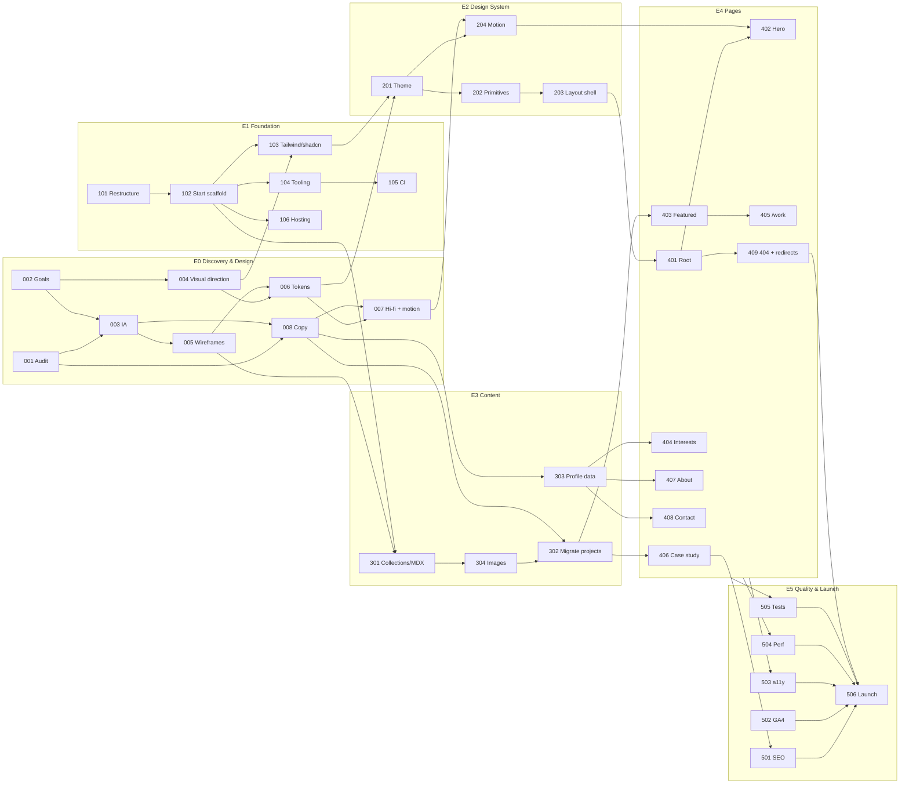

# Portfolio v4 — Rebuild roadmap

A ground-up rebuild of bibibran.co: new stack, new UX and new UI. This folder is the product backlog. Each ticket is a markdown file; update its **Status** field and the table below as work moves.

## Why
The current site (`bibibranco/`, moving to `legacy/`) is a 2023 Vite + React 18 SPA in plain JSX. Content is hardcoded inside components, routes use numeric ids (`/project/1`), crawlers see an empty page, and several facts and bits of copy are out of date. Bibi's day-to-day stack has moved on, and the design should too.

## Goals
1. **Show current work and skills.** The site itself is a portfolio piece: a fresh UX/UI built on a modern stack.
2. **Easy to keep up to date.** A new project is one MDX file; a CV change is one line.
3. **Findable and shareable.** Prerendered HTML, proper link previews, stable URLs.
4. **Accessible and fast.** WCAG 2.2 AA, Lighthouse ≥ 95.

## Stack decisions
| Area | Choice | Notes |
|---|---|---|
| Framework | **TanStack Start** (React 19, Vite, TS strict) | File-based, type-safe routing; static prerender |
| Styling | Tailwind v4 (`@tailwindcss/vite`) + shadcn on `@base-ui/react` | Same setup as `~/soletrador/frontend` |
| Utilities | cva, clsx, tailwind-merge, lucide-react, `@fontsource-variable/*` | |
| Content | MDX via content-collections + zod schema | `content/work/*.mdx` |
| Motion | `motion` | Reduced motion respected everywhere |
| Quality | ESLint flat + Prettier, Vitest, Playwright + axe, GitHub Actions | |
| Hosting | Vercel (new project; old one serves prod until launch) | Preview deploy per PR · staging: https://bibibrancov3-legacy.vercel.app · domain registered at Namecheap, DNS on Vercel nameservers |
| Analytics | GA4 `G-KR5JD1GYC2` (kept for data continuity) | |

## Milestones
| Milestone | Epics | Exit criteria |
|---|---|---|
| **M0: Design ready** | E0 Discovery & Design | Hi-fi designs and copy signed off (PORT-007, PORT-008) |
| **M1: Foundation** | E1 Foundation | Empty app builds, lints and deploys a preview on every PR |
| **M2: System & content** | E2 Design System, E3 Content | Tokens, primitives, layout shell; all projects in MDX |
| **M3: Pages** | E4 Pages | Every page built to design on preview |
| **M4: Launch** | E5 Quality & Launch | Audits pass, domain cut over, `legacy/` removed |

M1 does not depend on design, so it can run **in parallel with M0**. Only the font install (PORT-103) and tokens (PORT-201) wait on design outputs.

## Dependency graph

## Status board
Priority: **P0** blocks launch · **P1** expected at launch · **P2** nice to have.
Estimate: **S** ≤ half a day · **M** 1–2 days · **L** 3–5 days.

| Ticket | Title | Type | Priority | Est. | Depends on | Status |
|---|---|---|---|---|---|---|
| [PORT-001](00-discovery-design/PORT-001-content-audit.md) | Content audit & inventory | content | P0 | S | — | review |
| [PORT-002](00-discovery-design/PORT-002-goals-audience-metrics.md) | Goals, audience & success metrics | design | P0 | S | — | todo |
| [PORT-003](00-discovery-design/PORT-003-information-architecture.md) | Information architecture & sitemap | design | P0 | S | PORT-001, PORT-002 | todo |
| [PORT-004](00-discovery-design/PORT-004-visual-direction.md) | Visual direction & moodboard | design | P0 | M | PORT-002 | todo |
| [PORT-005](00-discovery-design/PORT-005-wireframes.md) | Mobile-first wireframes | design | P0 | M | PORT-003 | todo |
| [PORT-006](00-discovery-design/PORT-006-design-tokens-inventory.md) | Design tokens & component inventory | design | P0 | M | PORT-004, PORT-005 | todo |
| [PORT-007](00-discovery-design/PORT-007-hifi-designs-motion.md) | Hi-fi designs & motion spec | design | P0 | L | PORT-006, PORT-008 | todo |
| [PORT-008](00-discovery-design/PORT-008-copy-refresh.md) | Copy refresh | content | P0 | M | PORT-001, PORT-002, PORT-003 | todo |
| [PORT-101](01-foundation/PORT-101-repo-restructure.md) | Repo restructure | eng | P0 | S | — | review |
| [PORT-102](01-foundation/PORT-102-scaffold-tanstack-start.md) | Scaffold TanStack Start | eng | P0 | M | PORT-101 | review |
| [PORT-103](01-foundation/PORT-103-tailwind-shadcn-fonts.md) | Tailwind v4, shadcn & fonts | eng | P0 | S | PORT-102, PORT-004 | in progress |
| [PORT-104](01-foundation/PORT-104-tooling-lint-format.md) | Linting, formatting & scripts | eng | P1 | S | PORT-102 | review |
| [PORT-105](01-foundation/PORT-105-ci.md) | CI on pull requests | eng | P1 | S | PORT-104 | review |
| [PORT-106](01-foundation/PORT-106-hosting-previews.md) | Hosting & preview deploys | eng | P0 | S | PORT-102 | done |
| [PORT-201](02-design-system/PORT-201-tokens-theme.md) | Tokens in the Tailwind theme | eng | P0 | S | PORT-103, PORT-006 | todo |
| [PORT-202](02-design-system/PORT-202-core-primitives.md) | Core UI primitives | eng | P0 | M | PORT-201 | todo |
| [PORT-203](02-design-system/PORT-203-layout-shell.md) | Layout shell: header, nav, footer | eng | P0 | M | PORT-202, PORT-003 | todo |
| [PORT-204](02-design-system/PORT-204-motion-primitives.md) | Motion primitives | eng | P1 | S | PORT-201, PORT-007 | todo |
| [PORT-301](03-content/PORT-301-content-collections-mdx.md) | Content collections, MDX & project schema | eng | P0 | M | PORT-102, PORT-005 | todo |
| [PORT-302](03-content/PORT-302-migrate-case-studies.md) | Migrate case studies to MDX | content | P0 | L | PORT-301, PORT-008, PORT-304 | todo |
| [PORT-303](03-content/PORT-303-profile-data.md) | Typed profile data (experience, education, interests) | eng | P1 | S | PORT-008 | todo |
| [PORT-304](03-content/PORT-304-image-pipeline.md) | Image pipeline | eng | P1 | M | PORT-301 | todo |
| [PORT-401](04-pages/PORT-401-root-route-shell.md) | Root route: document shell, head & error handling | eng | P0 | S | PORT-203 | todo |
| [PORT-402](04-pages/PORT-402-home-hero.md) | Home: hero | eng | P0 | M | PORT-401, PORT-204, PORT-007 | todo |
| [PORT-403](04-pages/PORT-403-home-featured-work.md) | Home: featured work | eng | P0 | M | PORT-301, PORT-202, PORT-302 | todo |
| [PORT-404](04-pages/PORT-404-home-interests.md) | Home: "count me in for" interests | eng | P1 | M | PORT-303, PORT-202 | todo |
| [PORT-405](04-pages/PORT-405-work-index.md) | Work index `/work` | eng | P0 | M | PORT-301, PORT-403 | todo |
| [PORT-406](04-pages/PORT-406-case-study-page.md) | Case study page `/work/$slug` | eng | P0 | L | PORT-301, PORT-302, PORT-304 | todo |
| [PORT-407](04-pages/PORT-407-about-page.md) | About page `/about` | eng | P1 | M | PORT-303, PORT-202 | todo |
| [PORT-408](04-pages/PORT-408-contact-cta.md) | Contact call-to-action | eng | P1 | S | PORT-303, PORT-202 | todo |
| [PORT-409](04-pages/PORT-409-404-and-redirects.md) | 404 page & legacy redirects | eng | P0 | S | PORT-401, PORT-003, PORT-106 | todo |
| [PORT-501](05-quality-launch/PORT-501-seo.md) | SEO, social previews & favicons | eng | P1 | M | PORT-401, PORT-406, PORT-007 | todo |
| [PORT-502](05-quality-launch/PORT-502-analytics.md) | Analytics (GA4) | eng | P1 | S | PORT-401, PORT-002 | todo |
| [PORT-503](05-quality-launch/PORT-503-accessibility-audit.md) | Accessibility audit (WCAG 2.2 AA) | eng | P0 | M | E4 complete | todo |
| [PORT-504](05-quality-launch/PORT-504-performance-budget.md) | Performance budget | eng | P1 | S | E4 complete, PORT-304 | todo |
| [PORT-505](05-quality-launch/PORT-505-testing.md) | Automated tests | eng | P1 | M | PORT-105, PORT-301, E4 complete | todo |
| [PORT-506](05-quality-launch/PORT-506-launch.md) | Launch & legacy cleanup | eng | P0 | S | PORT-409, PORT-501, PORT-502, PORT-503, PORT-504, PORT-505 | todo |
## Conventions
- **IDs**: `PORT-0xx` discovery/design, `1xx` foundation, `2xx` design system, `3xx` content, `4xx` pages, `5xx` quality/launch.
- **New tickets**: copy [`_TEMPLATE.md`](_TEMPLATE.md) into the right epic folder, take the next free number, and add a row to the status board.
- **Branches/PRs**: `port-XXX-short-name`; put the ticket ID in the PR title. One ticket per PR where practical.
- **Done** means every acceptance criterion is checked, CI is green and the preview has been reviewed.
- **Design artifacts** (brief, inventory, sitemap) go in `tickets/artifacts/` or Figma, linked from the ticket.
- **Legacy paths**: tickets say `bibibranco/…` or `legacy/…`. They are the same files before and after PORT-101.

## Parking lot (not scheduled)
- Portuguese version of the site (i18n)
- Storybook for the design system
- Visual regression tests
- Blog/notes section
- Contact form with a backend
